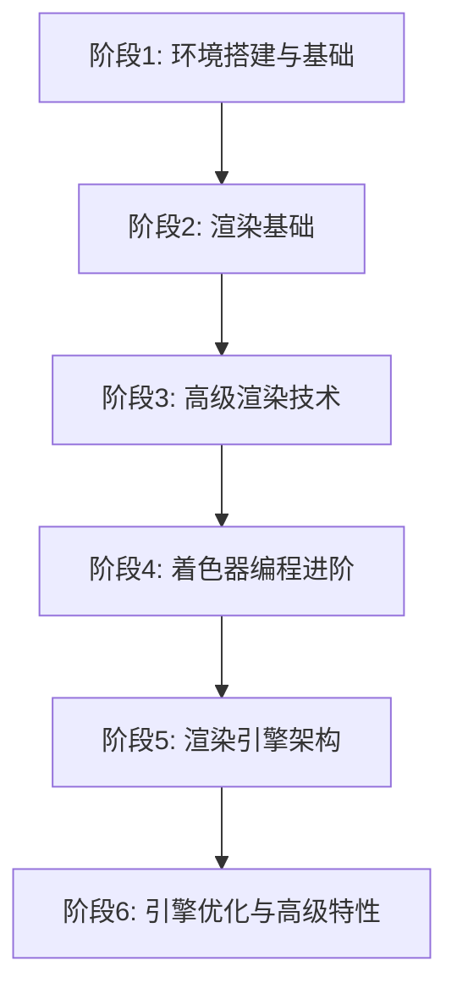

# C++ OpenGL 学习路径：从入门到引擎渲染

## 📚 文档导航

本学习体系分为 6 个阶段，每个阶段包含框架性问题指引、示例代码和实践项目。

### 学习路径概览

## 📖 分阶段文档

| 阶段 | 文档                                                          | 学习周期 | 核心内容                     |
| ---- | ------------------------------------------------------------- | -------- | ---------------------------- |
| 1    | [环境搭建与基础](./docs/Stage01_Setup_Basics.md)              | 1-2 周   | 开发环境、窗口创建、渲染管线 |
| 2    | [渲染基础](./docs/Stage02_Rendering_Basics.md)                | 2-3 周   | 顶点数据、纹理、变换矩阵     |
| 3    | [高级渲染技术](./docs/Stage03_Advanced_Rendering.md)          | 3-4 周   | 光照、模型加载、深度测试     |
| 4    | [着色器编程进阶](./docs/Stage04_Shader_Programming.md)        | 2-3 周   | GLSL、后处理、PBR            |
| 5    | [渲染引擎架构](./docs/Stage05_Engine_Architecture.md)         | 4-6 周   | 场景管理、资源系统、渲染器   |
| 6    | [引擎优化与高级特性](./docs/Stage06_Optimization_Advanced.md) | 持续学习 | 性能优化、延迟渲染、阴影     |

## 🎯 学习目标

### 初级目标（阶段 1-2）

- ✅ 掌握 OpenGL 基础 API
- ✅ 理解渲染管线流程
- ✅ 能够绘制基本 3D 场景

### 中级目标（阶段 3-4）

- ✅ 实现完整光照系统
- ✅ 掌握 GLSL 着色器编程
- ✅ 能够加载复杂 3D 模型

### 高级目标（阶段 5-6）

- ✅ 设计并实现渲染引擎架构
- ✅ 实现高级渲染技术（PBR、延迟渲染等）
- ✅ 优化渲染性能

## 🛠️ 技术栈

### 核心技术

- **C++17/20**: 现代 C++特性
- **OpenGL 4.6**: 图形 API
- **GLSL**: 着色器语言

### 必备库

- **GLFW**: 窗口和输入管理
- **GLAD**: OpenGL 函数加载
- **GLM**: 数学库
- **stb_image**: 图像加载
- **Assimp**: 模型加载

### 推荐工具

- **RenderDoc**: 图形调试
- **Visual Studio 2022**: IDE
- **CMake**: 构建系统
- **Git**: 版本控制

## 📝 学习方法建议

### 1. 理论与实践结合

- 每个概念都配有示例代码
- 边学边敲，不要只看不练
- 理解原理后再记忆 API

### 2. 框架性思维

- 每个阶段都有核心问题指引
- 通过问题驱动学习
- 建立知识体系而非碎片化学习

### 3. 项目驱动

- 每个阶段都有实践项目
- 从简单到复杂逐步迭代
- 最终目标：构建自己的渲染引擎

### 4. 调试技巧

- 学会使用 RenderDoc 分析渲染过程
- 掌握 OpenGL 错误检查
- 理解常见问题和解决方案

## 🚀 快速开始

### 前置知识要求

- ✅ C++基础（指针、类、继承等）
- ✅ 线性代数基础（向量、矩阵运算）
- ✅ 基本的计算机图形学概念

### 开始学习

1. 从 [阶段 1: 环境搭建与基础](./docs/Stage01_Setup_Basics.md) 开始
2. 按顺序完成每个阶段的学习
3. 完成每个阶段的实践项目
4. 遇到问题查阅对应章节或搜索引擎

## 📚 推荐资源

### 书籍

- 《OpenGL 编程指南》（红宝书）
- 《Real-Time Rendering》（第 4 版）
- 《Game Engine Architecture》

### 在线资源

- [LearnOpenGL CN](https://learnopengl-cn.github.io/)
- [OpenGL 官方文档](https://www.opengl.org/documentation/)
- [Khronos OpenGL Wiki](https://www.khronos.org/opengl/wiki/)

### 视频教程

- The Cherno OpenGL 系列
- ThinMatrix 游戏引擎开发

## 💡 常见问题

### Q: 需要什么样的硬件？

A: 支持 OpenGL 4.0+的显卡即可，近 5 年的集成显卡都能满足学习需求。

### Q: 学习周期需要多久？

A: 根据个人基础和投入时间，完整学完全部 6 个阶段需要 3-6 个月。

### Q: 是否需要图形学基础？

A: 不需要深厚的图形学基础，文档中会讲解必要的数学和图形学概念。

### Q: 学完能做什么？

A: 能够独立开发渲染引擎、游戏引擎渲染模块，或从事相关图形开发工作。

## 🔄 更新日志

- **2025-12**: 初始版本发布
- 持续更新中...

## 📧 反馈与贡献

如有问题或建议，欢迎提交 Issue 或 Pull Request。

---

**开始你的 OpenGL 学习之旅吧！** 🎮✨
